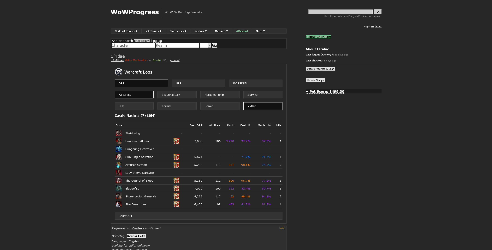

# WoWProgress Character Page



When I used to recruit for a World of Warcraft raiding guild, I was vetting players looking for guilds on [WoWProgress](https://www.wowprogress.com/) with their [Logs](https://www.warcraftlogs.com/) and (ocassionally) [Raider.io](https://raider.io/). However, this process was extremely tedious so I wrote this Userscript that automatically embeds third-party information inside of each character's WoWProgress page.

**Note:** This project is not affiliated with any of the other websites mentioned in this guide.

# Installation Guide

1. Install a Userscript manager for your web browser
    * [Greasemonkey](https://addons.mozilla.org/en-US/firefox/addon/greasemonkey/) (Firefox)
    * [Tampermonkey](https://www.tampermonkey.net/) (Chrome, Firefox, Safari, Edge)

2. [Download the latest build](https://github.com/Trinovantes/userscript-wowprogress-character-page/releases/download/latest/userscript-wowprogress-character-page.user.js). If you have Greasemonkey or Tampermonkey installed, then you should immediately be prompted with a confirmation window asking you if you wish to install this Userscript.

3. Register a Warcraft Logs v2 API key (https://www.warcraftlogs.com/api/clients/). 

    * The name field can be whatever you want but I suggest using a descriptive name to help the Warcraft Logs developers to identify your usage
    * The redirect URL doesn't matter for our purpose so it can just be any valid URL (e.g. `https://www.wowprogress.com`)
    * Do **not** enable PKCE
    * Once successful, the site should give you a client id and secret
    
4. Open a new tab to WoWProgress and navigate to any character page. You will be asked to enter your client id and secret that you obtained in the previous step.

# Dev Guide

1. Install prereq

    * `node`
    * `yarn`
    * Tampermonkey on Chrome

2. In Chrome:
    
    * Go to `chrome://extensions/`
    * Go into Tampermonkey's details
    * Enable `Allow access to file URLs`

3. Run dev server

    ```
    yarn install
    yarn dev
    ```

4. In Chrome:

    * Go to `http://localhost:8080/userscript-wowprogress-character-page.proxy.user.js` and install the script

# FAQ

### Will you implement X feature?

> I will not be implementing new features because I do not play World of Warcraft anymore due to lack of time and interest. However, I will keep this script up-to-date with the newest raid.
